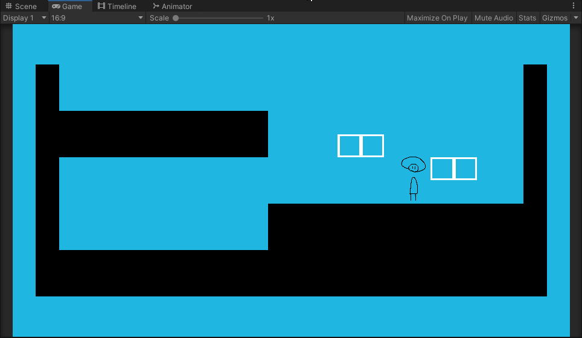
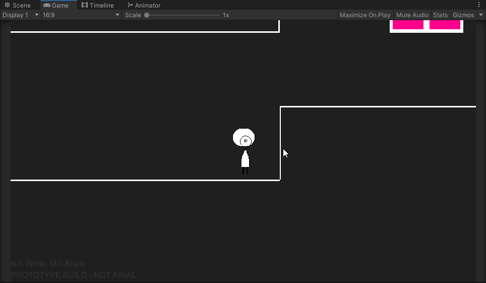
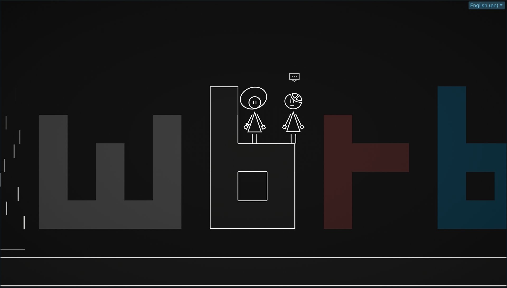

I'm Nextin, the current leader and main developer (and artist) of Mono-Space, I wanted to make this quick little blog to talk about the art style of the game.

# Quick recap for newcomers
Mono-Space is a 2D puzzle platformer with a unique color-shifting mechanic, the player has to use **the Heart of Corollorum** to shift between layers of the dimension to discover secrets, solve puzzles and avoid obstacles. Alongside the **Heart**, you also get the **Hyperllorum Bracelet**, a device that uses the heart's power to attract objects to the player.

# The first sketches
This screenshot from 2020 shows one of the earliest versions of the game, before the art style had been finalized. 

You can also see the first ever iteration of **Mono**, the game's protagonist!

One of the first things I decided to make were right angle thin tiles, which worked well with Unity's 2D Tilemap system for creating levels, although at the time I didn't really know what I was doing, so they had some weird spacing issues.

A few weeks later, I began sketching the final art style for the game, and unlike what a lot of people say I did not take any inspiration from big N's games; I took some inspiration from late 2000s indie games and the color distortions of SCART connections.
I wanted everything in the game, including the characters and items, to be fully geometrical and polygonal, with a consistent stroke width so everything had to be simplified down to the basic shapes necessary to still convey the same message. This made a lot of things like characters and items easier to make, but it also made things like levels way harder to make considering I was limited to a basic tileset of 45° and you can only convey so much with squares and triangles in black and white, so I had to improvise; for instance, inactive layers will use filled tiles with their respective theme color to show that there is something there, trees use a combination of square and triangle tiles to represent the log and leaves, while water appears as transparent filled tiles.

# The finalized art style
The art style for the game has now been finalized, and it has remained the same since 2021. However, I have deviated from the old design rules a bit to make more unique characters. For example, "WR" has a uniquely shaped head that doesn't strictly follow the rules, but it was necessary to achieve the desired look with simple shapes, so now everything can use compound shapes as well.

This is what the game looks like now, in this screenshot you can see Mono, "WR", the inactive layers and the base geometry!

Thanks for reading this blog post!